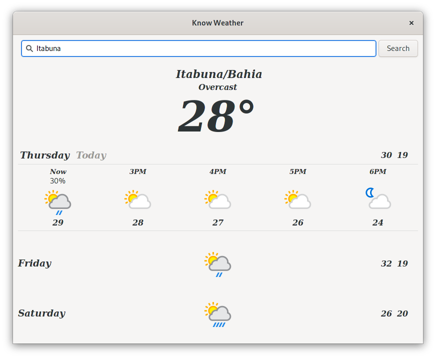
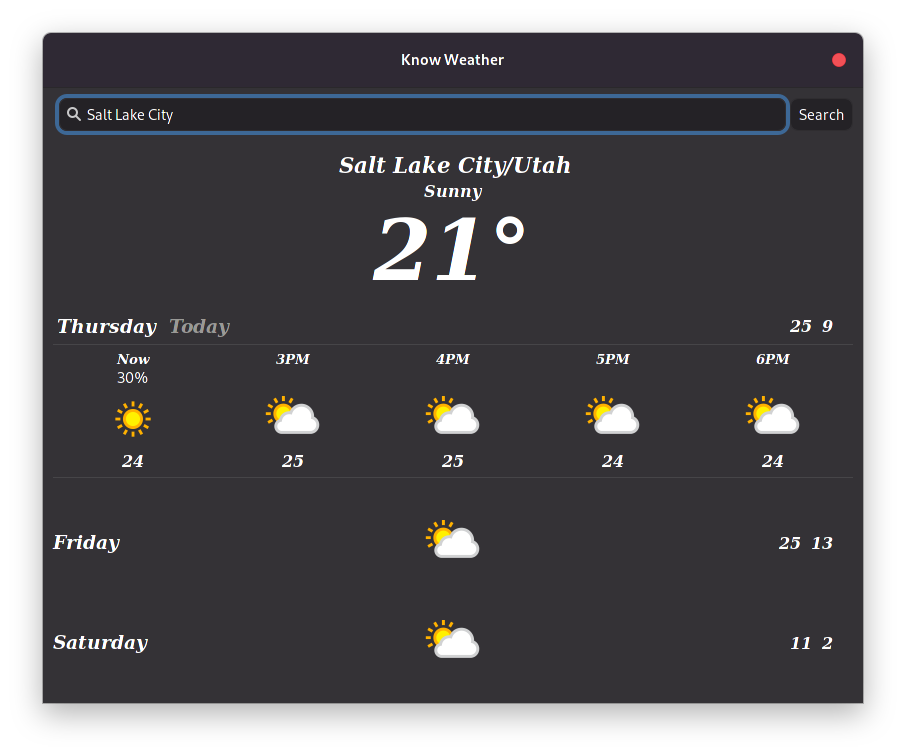

<h1 align="center">Know-Weather-GTK</h1>
<h2 align="center">
GTK interface to see the cities's weather informations<br><br>
    <a href="https://github.com/PabloEmidio/Know-Weather-GTK/stargazers"></a>
    <a href="https://github.com/PabloEmidio"></a>
</h2>

---
# ⚈ About
This program is in development, when done, it will able to show several kinds of weather information
---

# ⚈ Requirements

```
pip3 install -r requirements.txt
```
---

# ⚈ How to use
After to clone this repository, it will be necessary that you access the Weather API in [https://www.weatherapi.com/](https://www.weatherapi.com/) for getting an API KEY. as long as you create your own account and get your API KEY, put it into credentials.env.example file where this points, take off the ".example" of the name and done.
now the program is ready, just use it.

---

## ⚈ Some Screenshots
<h1 align="center">
  <br>
</h1>

---

# ⚈ Tech Stack

The following tools were used in the construction of the project:

- [Python](https://www.python.org/)
- [Gtk](https://www.gtk.org/)
- [Glade](https://glade.gnome.org/)

---

# ⚈ Bugs and Features
<p>
Please report any type of bug. Remember that this is an open source project and will evolve with everyone's help. :)<br>
Any report will be read and will get due attention
</p><br>
<p>
New features are being done and new ideas are being created always that possible...<br>
new ideas will be accepted...
</p>

